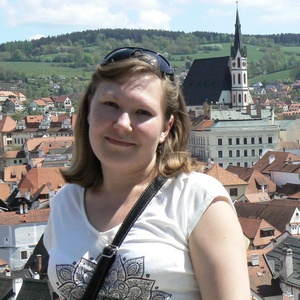

# Diana Tipunova #   


***
### Contacts ###
***
+ **Phone:** 375293880573
+ **E-mail:** dianatipunova@gmail.com
+ **GitHub:** DianaTip
+ **Discord:** DianaTip
### About me ###
***
After graduating from university (quite a long time) I work as an engineer in a company. The purpose of studying at rs school is to gain new knowledge. The ability to remember the basics of programming and get back to working on projects. I consider myself a purposeful person.
### Skills ###
***
+ Visual Fox
+ C++
+ Delphi
+ HTML
+ CSS

### Code examples ###
***
```
function nicknameGenerator(name){
  var res = name.split('')
  if (name.length<=3)
  {return "Error: Name too short"} 
  else 
     if (res[2] == ['a'] || res[2] == ['e'] || res[2] == ['i'] || res[2] == ['o'] || res[2] == ['u'])
        {return name.substr(0,4)}
     else 
        {return name.substr(0,3)} }
```
### Education ###
***
Novosibirsk State Technical University
+ **courses: -**  protection of corporate networks;
+ **-**           ACS based on microprocessor technology;
+ **-**           JSFEPRESCHOOL
+ **project: -**  [CV](https://dianatip.github.io/rsschool-cv/cv/ "CV")
+ **-**           [Momentum](https://rolling-scopes-school.github.io/dianatip-JSFEPRESCHOOL2022Q4/momentum/ "Momentum") 

### Expirience ###
***
Engineer in the company

### Language ###
***
+ Russian
+ English - In the process of self-study